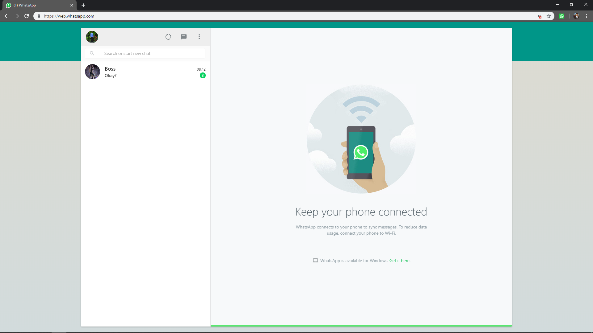
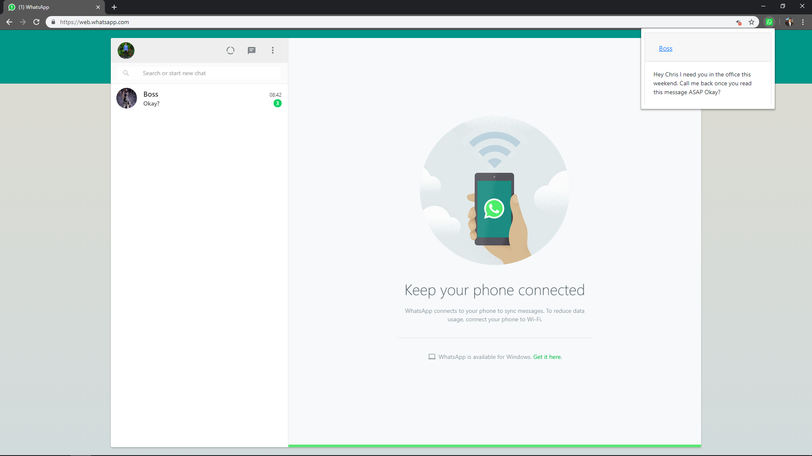

# Whatsapp Peek

We all have messages we want to read but not for immediate process. With WhatsApp Peek, you can now confidently read unread messages without the sender knowing!

# Requirement

- Google Chrome

# How to Use

1. Install this application as a Chrome extension. 

   In your Chrome browser settings, go to `More Tools > Extensions` and turn on `Developer mode`. Then, click `Load unpacked` and select the `src` directory of this repo. 

2. Open [Whatsapp Web](https://web.whatsapp.com/).

   That's it! You can move to other tabs now, just don't close the Whatsapp Web tab.

   
